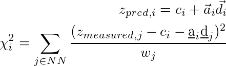

### Abstract:
---
---
After reading several papers on the topic I had to reevaluate the
methods that were used and test their accuracy and re-implement the
majority of them.

Photometric redshift estimation is a highly popular area and is still
very important today as a huge portion of the sky is not accurately
measured or measured at all by spectroscopists so finding the redshift
of available data and developing a good method and tool to accurately
predict it would be highly beneficial for all.

My task is to get familiar with these concepts and try to find the best
among them with machine learning techniques and general clustering
algorithms.

---
---

The problem
===========

The Sloan Digital Sky Survey has done an imaging survey in five optical
bands which was later on followed by a spectroscopic measurement where
more than a million galaxy was observed. The optical bands were matched
with the right spectroscopic data and magnitudes and redshifts were
calculated. It is all stored in a huge database which is available on
the SDSS SkyServer [@server].

The magnitudes and petrosian magnitudes, which is corrected for each
galaxy type and by other factors as well, can be found in this database
with the appropriate errors and the spectroscopic data can be joined to
it as well.

The database is a simple SQL database and scripts can be submitted to
the CasJobs page on SkyServer to run and get the data from the servers.
Therefore anyone has access to it freely and is able to do his/her
experiments on it. I acquired most of my data by running this script:

        SELECT
      p.modelMag_u as m_u,
      ...
      p.modelMag_z as m_z,
      p.petroMag_u as pm_u,
      ...
      p.petroMag_z as pm_z,
      p.modelMag_u-p.extinction_u-p.modelMag_g+p.extinction_g as ug,
      ...
      p.modelMag_i-p.extinction_i-p.modelMag_z+p.extinction_z as iz,
      p.petroMag_u-p.extinction_u-p.petroMag_g+p.extinction_g as p_ug,
      ...
      p.petroMag_i-p.extinction_i-p.petroMag_z+p.extinction_z as p_iz,
      s.z as z into mydb.MyTable from PhotoObj AS p
      JOIN SpecObj AS s ON s.bestobjid = p.objid
    WHERE
      p.probPSF=0 AND
      p.petroMagErr_u/p.petroMag_u BETWEEN 0 AND 0.05 AND
      ...
      p.modelMagErr_z/p.modelMag_z BETWEEN 0 AND 0.05

The **WHERE** clause states that I selected only galaxies from the SDDS
DR7 database and all the acquired data have less then 5% error. This
procedure resulted in 750’000 lines, although to run my simulations I
only used a tiny bit of this in order to be able to make it run faster
and handle errors in run time.

On this data set, I had to do the photometric redshift estimation. In
order to do this I had to try different clustering algorithms myself and
after that I had to move on with implementing the procedure from Róbert
Beck’s article [@beck]. I got familiar with the problem by scanning
through professor Csabai’s article [@csabai] and implementing some of
the algorithms that could be found there and plotting the galaxy
distributions by color indices.

Empirical methods
=================

Approach
--------

The acquired data was in *.csv* file format which can be easily read and
processed by *pandas* package [@pandas] in . After reading the data I
made the plots for model and petrosian magnitudes as well. The following
figures will show the differences in color space:

I consider this data as comparison baseline for the template data I have
later on generated. Not only does the data need to cover the whole color
space but also it should not contain too many outlier galaxies. This is
taken care of as I only selected data points with small errors. A
train-test split was done in 80%-20%.

Implementations, results
------------------------

First of all I used a naive k-Nearest neighbor method. A brief
introduction to the algorithm is the following: there’s a huge labeled
dataset, the training dataset, with the appropriate color bands and
redshift values. Using the test dataset we are looking for its k nearest
neighbors and setting its redshift value to the mean of the nearest
neighbors.

On the other hand, I mostly used the algorithms from the *sklearn*
package [@sklearn] which includes KNN, support vector machine (SVM) and
random forest algorithms, which are very well optimized and are using
great tricks to store and handle data efficiently. For example, the KNN
algorithm provided by *sklearn* used *kd-trees*, a data structure that
is fast to search and build from training data, therefore it is fast do
find the nearest neighbors of any given point after training the model.

For validation purposes the training and test sets are gathered from the
same source and both have measured redshift values. Therefore I was able
to generally say something about the goodness of my predictive models,
by predicting the acquired and measured redshift values. Cross
validation

Results are shown on the plots and values below:

It is quite easy to see that the KNN algorithm is the best for the
problem since the predicted redshift values for the training set fit
well the measured redshift values of the training set. However, my naive
KNN is way slower than the one provided by *sklearn* and needs to be
batched for a huge input data file, thus gets worse and does not scale
well. The support vector machine and the random forest algorithms does
not predict redshifts very well for values lower than 0.15, thus later
on I am going to use *sklearn*’s KNN.

Below a comparison can be seen for a five split cross validation for **k
= 7** nearest neighbors. For this purpose a ten thousand line 5% error
limited data file was used.

| **Method**             | **MAE**               | **MSE**               | **Duration \[s\]** |
|------------------------|-----------------------|-----------------------|--------------------|
| Random forest          | 0.04296 +/- 0.00362   | 0.00850 +/- 0.00388   | 31.01              |
| Support vector machine | 0.05080 +/- 0.00328   | 0.00809 +/- 0.00322   | 1.07               |
| **KNN**                | *0.02364 +/- 0.00127* | *0.00596 +/- 0.00348* | **2.28**           |
| Naive KNN              | 0.02364 +/- 0.00127   | 0.00596 +/- 0.00348   | *612.25*           |

  : Comparison of different algorithms on the example dataset

The best and worst values are presented in italics. It can be clearly
seen that the best option is the KNN algorithm, using kd-trees from
*sklearn*. It can be seen that without batching the naive KNN gives the
same results but is much slower.

 Local linear regression
========================

Theory
------

According to the article of Beck [@beck] I was able to implement a local
linear regression method by finding the k nearest neighbor of a test
data point and fitting a linear function on those with the least-squares
method. The process is the following: at first I needed to acquire the
N(=100/166) nearest neighbors, secondly a least squares fitting must
have been done, thirdly a prediction for the fitted nearest neighbors
must be done to exclude the outlying values, finally the redshift must
be predicted with the outlying values left out.

I am applying normalization on the data points as well, therefore, I am
subtracting the mean of the data points and dividing by the standard
deviation. This ensures that my data is correctly fitted and is less
prone to rounding errors. The applied equations are the following:

Where, according to Beck **d**i contains the **r** band and
all the color indices **ug**, **gr**, **ri**, **iz**. The photometric redshift
is predicted by doing a linear fit with the *sklearn* package by
minimizing the **\chi^{2}** for each index.

After the fit the k nearest neighbors are gathered and they must be
predicted with the local linear model. If their relative error
calculated below is three times bigger, than the deviation of the
predicted value, from the measured value, the fitted data point is
dropped and the fit must be done again without the outlying neighbors.
The weights (**w_{j}**) are all considered to be ones, however a weighted
nearest neighbor algorithm can be fitted as well by using the standard
 weight metrics.

Results
-------

By implementing this algorithm I acquired the following results:

The train-test splits were made using a 20%-80% split by randomly
shuffling the dataset for acquiring the most appropriate results.
However, the fitted data can be qualitatively described by the these
statements:

-   the wave-like shape has disappeared around the 45**^{\circ}**,
    **z_{pred} = z_{measured}** line this is considered good since it
    shows that the fit is actually showing signs of linearity

-   the mean squared error is approximately the same as with the KNN
    algorithm but after excluding the outliers it gets way better

-   analyzing the results of the cross validation it cannot be said that
    this approach is the best among all other since it isn’t the most
    stable regarding the standard deviations of MAE and MSE

    **Method**            **MAE**                 **MSE**          **Duration \[s\]**
  --------------- ----------------------- ----------------------- --------------------
        KNN        0.02438 +/- 0.00035   0.00517 +/- 0.00011       **12.12**
   Beck’s method   0.0267 +/- 0.00042    0.0069 +/- 0.00071          178.6

  : Comparison of sklearn’s KNN and Beck’s local linear regression

The downside of the local linear regression fit is that is much slower
than KNN, although that is not really considered bad since we have
better computers and generally we don’t need fast algorithms, we need
algorithms that finish in reasonable time and give the best results. It
is very hard to say that the standard KNN algorithm is better since the
scientific method gave a more linear result not by MAE or MSE but by
pure reasoning according to the plots. (The cross validation was re-done
for the KNN algorithm using the same 20%-80% split, shuffling and
method.)

 Template fitting
=================

After completing the tasks above I headed to experiment with the so
called template fitting where theoretical galaxy spectra is generated
with different redshift values and best fits are selected compared to
real, measured data points. This way it is possible to generate a model
without having too many measured values. However, this method is
considered much worse than the others above, and according to my
calculations it is indeed much worse.

Photometric redshift is defined as:

****\begin{aligned}
    z = \frac{\lambda_{observed} - \lambda_{emitted}}{\lambda_{emitted}} \\
    \lambda_{observed} = \lambda_{emitted}(1+z)\end{aligned}****

Where the emitted spectrum is given from a template set. For this reason
I used **299** spectrum files with wavelength and spectral value pairs.
After applying the filters AB magnitudes had been calculated.

Whereas c is the speed of light **S(\lambda)** is the spectral function
and **r(\lambda)** is the filter function which was acquired from
voservices [@voservices]. Some of the selected spectral functions and
all the filters are presented below:

The AB magnitudes were calculated as:

For the integrals I used the following numerical method. I didn’t
re-sample the data because I couldn’t find a general enough algorithm to
do that so I wrote one. Firstly I looked for the minimum and maximum
index of the nearest wavelength in the filters and in the spectral
distribution. When that was found, I ran through that part of the
spectral function and always multiplied the appropriate spectral value
with the nearest filter-function value according to the wavelength. With
this method I approximated the integrals and took into account that the
wavelengths are in Angström.

    from sklearn.neighbors import NearestNeighbors

    def get_spectrum(spectrum, color_filter):
        # min/max wavelength
        min_lambda = color_filter[:,0][0]
        max_lambda = color_filter[:,0][-1]
            
        # find nearest min/max indices
        min_nearest_ind = np.abs(spectrum[:,0]-min_lambda).argmin()
        max_nearest_ind = np.abs(spectrum[:,0]-max_lambda).argmin()
            
        # integral of response function
        c = 3*10**8
        bin_width = color_filter[:,0][1] - color_filter[:,0][0]
        filter_integral = c*np.sum(color_filter[:,1]/color_filter[:,0])
        # dimension correction
        filter_integral *= 10**10
            
        flux = 0.
            
        # NN algorithm
        neigh = NearestNeighbors(n_neighbors=1, algorithm='kd_tree')
        neigh.fit(color_filter[:,0].reshape(-1, 1))
            
        for ind, val in enumerate(spectrum[:,0][min_nearest_ind:max_nearest_ind]):
            nearest_ind = neigh.kneighbors(np.array([val]).reshape(1, -1),
                 return_distance=False)[0,:][0]
            delta_flux = color_filter[:, 1][nearest_ind]*spectrum[:,1][ind]*val
            # dimension correction
            delta_flux *= 10**(-10)
            flux += delta_flux
        return -2.5*np.log10(flux/filter_integral) - 48.60

The templates were acquired from the Le Phare [@lephare] dataset and
most of the galaxy templates were used. I also acquired galaxy templates
from Laszlo Dobos but I didn’t use them since they didn’t cover the
whole wavelength spectrum, therefore it wouldn’t have been possible to
return all color indices as the final goal of this process is to deduct
the appropriate color indices with the matching redshift values.

Using N dataset from Le Phare (N=299), applying the band filters (5) for
each of them and setting a step size (step size = 150) for incrementing
the redshift value the wavelengths were multiplied in each step and the
color bands recalculated. This results in N\*bands\*step\_size data
points and thus much more calculations. This process was painfully slow
therefore I was only able to generate at most 45 000 lines of template
data and match less then half of it using ~ 800 000 lines of
measured data.

The matching was done with KNN algorithm for the whole dataset line by
line using *sklearn* therefore it was easy and fast to match even hugh
amounts of data. Only a small portion of it (~ 20%) was selected
for further process since most of the template data is junk and only
some of it can be used as representative. The matching was done using
the **ug, gr, ri, iz** color indices and the **redshift** value. However, as
it can be seen below the matched data is not correct since it does not
cover the whole color space. It is sometimes completely off, thus those
data points are excluded since they only issue &gt; 0.5% of the dataset.

It can be clearly seen that this is not the same as before for the
measured data set and is not even close. It shows some resemblance to
the petrosian data points but is objectively bad. Using a 20%-80%
train-test split and excluding the completely off predictions the
results are:

The matched set contained 12 000 points and around 9600 was used as test
set. Approximately 3% of it contains outliers and &gt; 0.5% is
completely of by the predictor. The Beck method fails on the template
set due to the fact that some points are amongst the points more than
once and the linear regression can’t be done properly. Also a huge
issue, that the data points do not cover the color space at all.

Overview
=================

Therefore I completed all the tasks required to finish this project. I thinks that I made 
great progress throughout the weeks and I have overdone what I had to do. However, I am sure that 
there is some kind of problem with my template fitting as it has to be bad, but not this bad. My predictions
are way off. All in all, I consider this work successful and I am happy that I could work on this. It 
raised my interest more to progress in the machine learning field further.

## @Regards, Alex